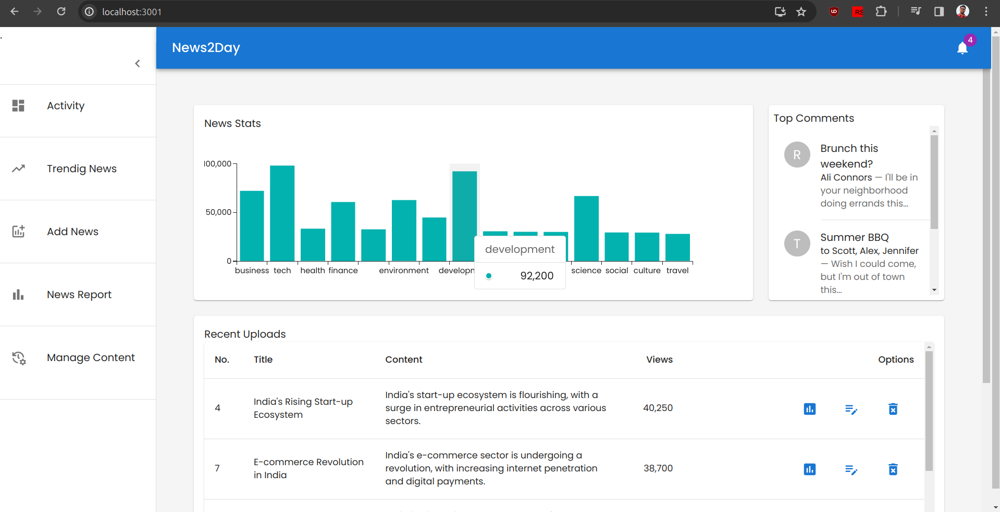
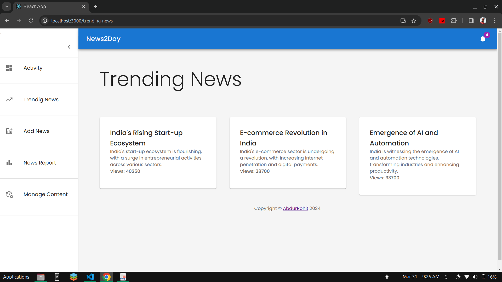
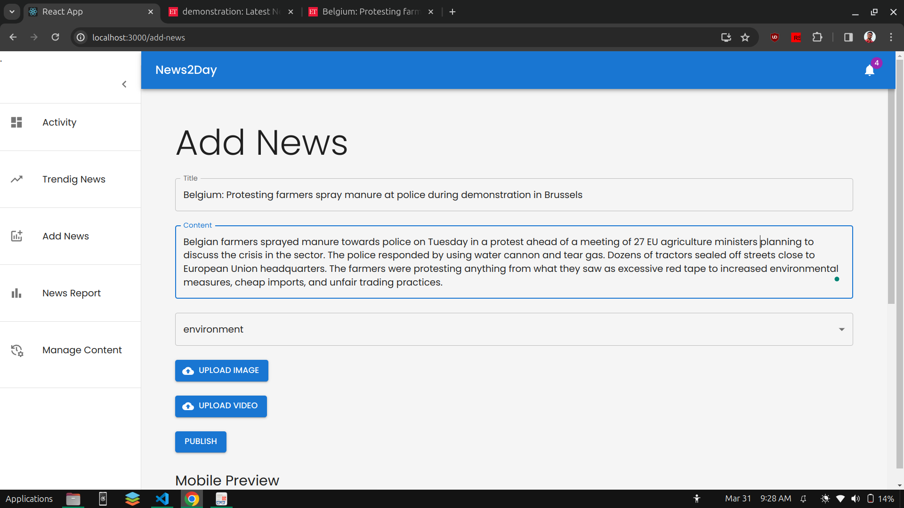
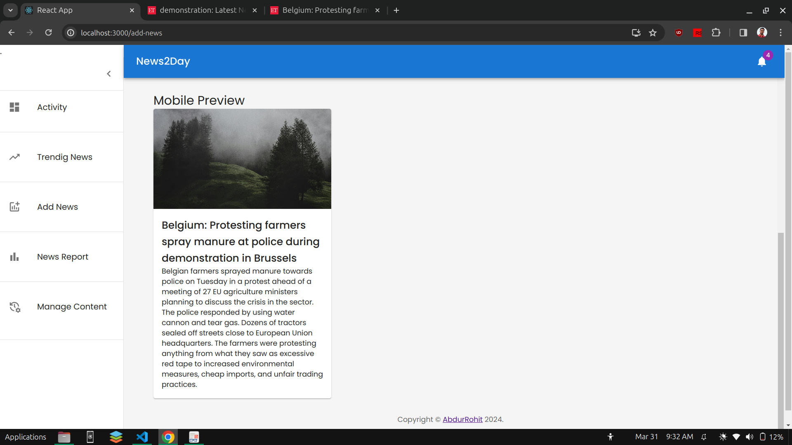
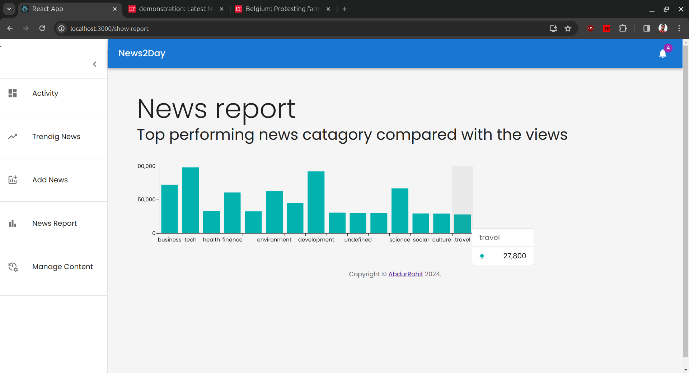
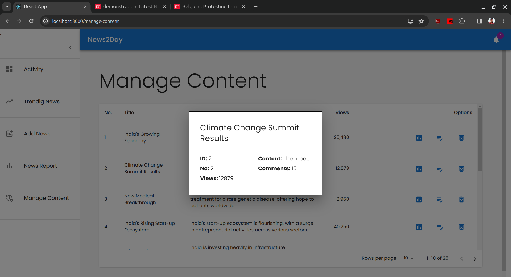
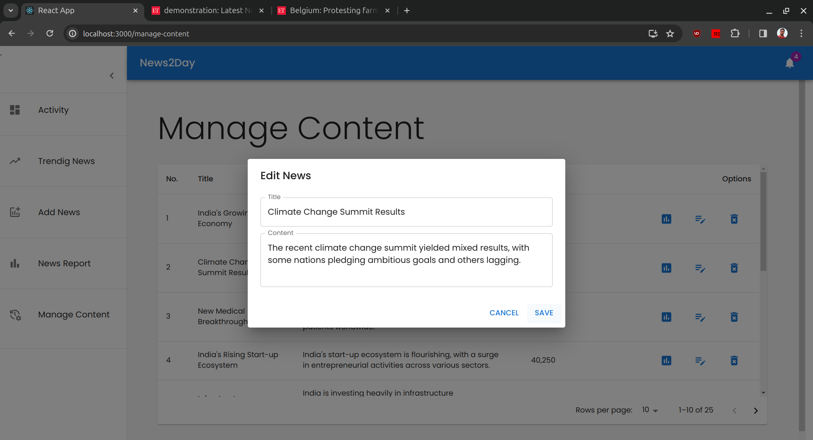
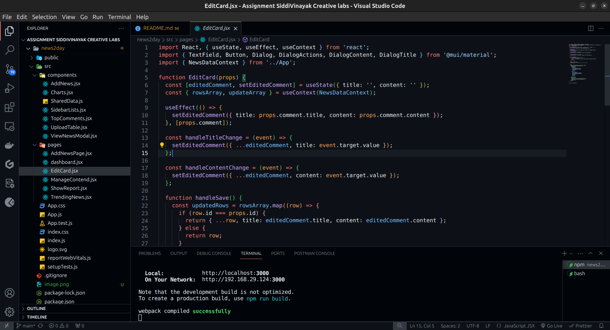
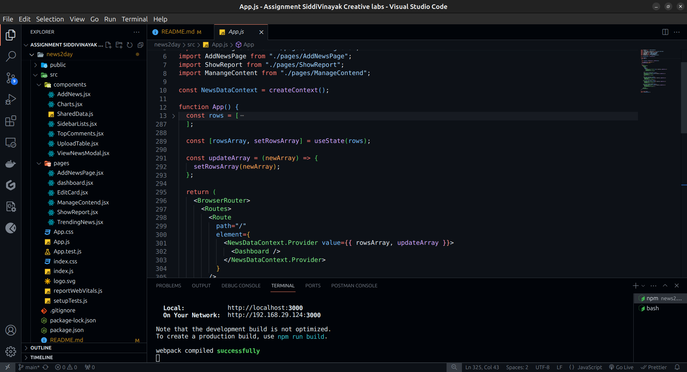

# Admin dashboard for News

# Installation guide

In the project directory, you can run:
### `npm install`

### `npm start`

Runs the app in the development mode.\
Open [http://localhost:3000](http://localhost:3000) to view it in your browser.

The page will reload when you make changes.\
You may also see any lint errors in the console.

### `npm test`

Launches the test runner in the interactive watch mode.\
See the section about [running tests](https://facebook.github.io/create-react-app/docs/running-tests) for more information.

### `npm run build`

Builds the app for production to the `build` folder.\
It correctly bundles React in production mode and optimizes the build for the best performance.

The build is minified and the filenames include the hashes.\
Your app is ready to be deployed!

See the section about [deployment](https://facebook.github.io/create-react-app/docs/deployment) for more information.

# Dashboard 

## Activity: 
Provides quick access to key
metrics and functionalities of the admin panel. This could include user activity, content statistics, and quick links to manage news feeds, view performance reports,top performed news, top shared news, top commented news, etc.

## Trending News
Top 3 trending news. Comparing the views count.

## Add News
Add title, Content, ./images/image and Video for new news.

### Mobile preview
A mobile preview screen, enabling
administrators/sub-editors/content writers to see how the news feed will appear on mobile devices before publishing.

## News report
A bar graph ploted with detailed analysis with views as respect to the news catagory.

## Manage content 
All uploaded news with options to view analytics, edit, and delete the news.

### News analytics

### Edit uploaded news

# Code structure
Used Context API to pass the news data among all the components.

Seperate components and pages. Using `useContext` inside child component to recive the array and passing `updateArray` functions to update the array as needed.

# API call
Inside the App.js file cahange the rows data array with a `fetch API` call and from backend and change the value parameters. 

